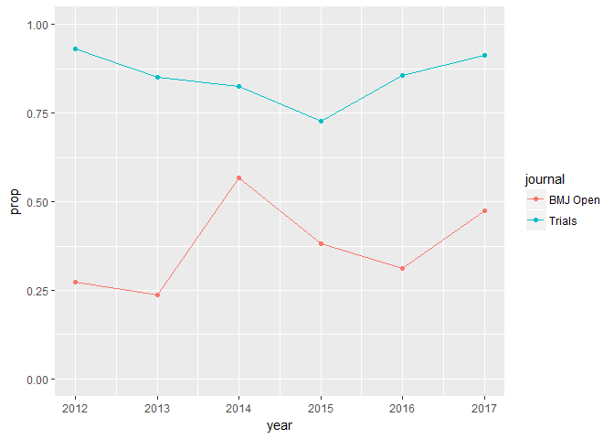

Preregs
================
Jonas Rafi
13 mars 2018

Pre-registration of published study protocols in two journals: a crude comparison
=================================================================================

Aim
---

Comparing the yearly amount of pre-registered study protocols in two journals.

Introduction
------------

The journals BMJ Open and Trials invites authors to publish study protocols. Both of them have guidelines stating that pre-registration information should be included in the abstract under the heading "Trial registration". However, BMJ Open enforces pre-registration for all study protocols, whereas Trials acknowledge that pre-registration is necessary for health care interventions on human subjects.

Method
------

Using Scopus web-search to find the number of published study protocols for BMJ Open and Trials, with and without the string "registration" in the abstract. At first I tried with the package "rscopus", but I wasn't able to connect to their API.

### Search criteria were:

-   ISSN("1745-6215") AND TITLE("Study protocol")
-   ISSN("1745-6215") AND TITLE("Study protocol") AND ("registration")
-   ISSN("2044-6055") AND TITLE("Study protocol")
-   ISSN("2044-6055") AND TITLE("Study protocol") AND ("registration")

The number of publications for the years 2012-2017 were written into this file. 2012 was set as starting year due to the low amount of prior publications in BMJ Open.

### Entering the data into R

``` r
data <- data.frame(year = c(2017, 2016, 2015, 2014, 2013, 2012, 2017, 2016, 2015, 2014, 2013, 2012),
                   journal = c(rep("BMJ Open", 6), rep("Trials", 6)),
                   total = c(204, 183, 97, 83, 42, 22, 461, 442, 456, 391, 333, 162),
                   reg = c(97, 57, 37, 47, 10, 6, 421, 378, 331, 323, 283, 151)
)

data$prop = data$reg / data$total
```

Results
-------

``` r
ggplot(data, aes(x = year, y = prop)) +
  geom_point(aes(color = journal)) +
  geom_line(aes(color = journal))
```



Despite having a more flexible approach to pre-registration, Trials seem to have a higher proportion of published study protocols mentioning trial registration in their abstracts.
